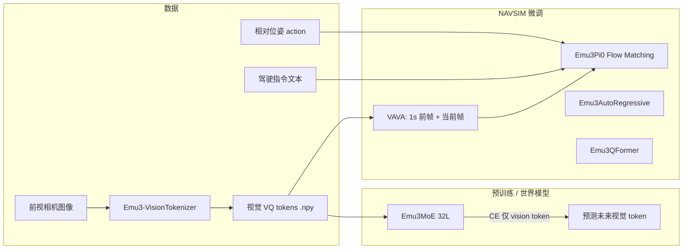
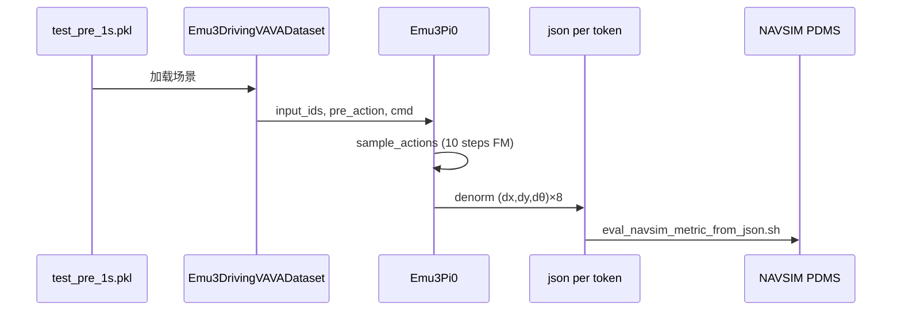

# DriveVLA-W0 代码与模型技术分析

> **论文**：DriveVLA-W0: World Models Amplify Data Scaling Law in Autonomous Driving（ICLR 2026）  
> **仓库说明**：公司政策仅公开部分代码；本文档基于当前仓库可见文件归纳，路径以脚本中的历史部署路径为例，本地需替换。

---

## 1. 项目目标与训练范式

DriveVLA-W0 将自动驾驶建模为 **视觉-语言-动作（VLA）** 问题，并引入 **世界建模（World Model）**：

1. **世界模型阶段**：在离散视觉 token 序列上预测未来帧（next-token / 加权 CE），迫使模型学习场景动力学（自监督信号密集）。
2. **动作阶段**：在 VLM 表征之上，用多种 **动作头** 预测轨迹（Flow Matching、自回归 token、Q-Former 等），在 NAVSIM 上评测 PDMS。

与纯行为克隆相比，世界建模缓解 VLA 的 **监督稀疏** 问题，使数据规模扩展更有效（论文主张的 scaling law）。



---

## 2. 代码目录结构（已开源部分）

```
DriveVLA-W0/
├── reference/Emu3/          # Emu3 核心：tokenizer、mllm（Emu3MoE/Pi0/AR/QFormer）
├── reference/transformers/  #  vendored HF（体量大，训练依赖其 Trainer/DeepSpeed 集成）
├── reference/Qwen2.5-VL/    # 可选 Qwen-VLA 参考实现
├── utils/                   # 训练入口（train_*.py）、datasets.py
├── models/
│   ├── policy_head/         # FlowMatching、diffusion_policy、MoE 辅助模块
│   └── tokenizer/           # action_tokenizer、VQ 提取脚本
├── configs/                 # MoE JSON、FAST action tokenizer、归一化统计
├── scripts/                 # 预训练 / SFT / NAVSIM 训练 shell
├── tools/pickle_gen/        # NAVSIM/NuPlan pickle 元数据生成
├── inference/
│   ├── vla/                 # Emu3 推理与 PDMS JSON 评估
│   ├── navsim/              # NAVSIM v1.1 评测子模块
│   └── qwen/                # Qwen 路线推理
└── doc/                     # 本文档
```

**注意**：部分 shell 调用 `train/train_pi0.py`，而仓库中训练脚本实际位于 `utils/train_pi0.py`；运行前需改路径或建立符号链接。

---

## 3. 模型族与职责

| 模型类 | 定义位置 | 用途 | 训练脚本 |
|--------|----------|------|----------|
| `Emu3ForCausalLM` | `reference/Emu3/emu3/mllm/modeling_emu3.py` | 基础因果 LM | `utils/train.py` |
| `Emu3MoE` | 同上 | 世界模型 + 可选 action expert（配置 `action_experts`） | `utils/train_moe.py` |
| `Emu3Pi0` | 同上 | **主推**：VLM 与 32 层 Action Expert **逐层共享注意力** + Flow Matching | `utils/train_pi0.py` |
| `Emu3AutoRegressive` | 同上 | 动作离散 token 自回归 | `utils/train_ar.py` |
| `Emu3QFormer` | 同上 | Q-Former 式动作查询（可接 anchor） | `utils/train_qformer.py` |
| `Emu3-VisionTokenizer` | `reference/Emu3/emu3/tokenizer/` | 图像→VQ codebook（32768） | 离线 `extract_vq_emu3_navsim.sh` |

### 3.1 Emu3MoE（世界模型预训练）

- **输入**：`input_ids`（文本 + 视觉 token 串）、`labels`（通常只对 `bov`–`eov` 视觉 token 计算 CE）。
- **输出**：`logits` `(B, L, vocab_size)`，加权交叉熵；`vision_loss_weight` 提高视觉 token 权重（配置中常见 `0.5`–`1.0`）。
- **配置示例**：`configs/moe_fast_video.json`  
  - VLM：`hidden_size=4096`, `intermediate_size=14336`, `num_hidden_layers=32`, `num_attention_heads=32`, `num_key_value_heads=8`（GQA）  
  - `action_config`：2 层、用于 MoE 内嵌 expert 试验（预训练脚本中 `action_experts: false`，主要靠视觉 CE）。

### 3.2 Emu3Pi0（Flow Matching 动作，PDMS 87.2+ 路线）

**结构**：

- `self.vlm`：从 NuPlan 预训练 checkpoint 加载的 `Emu3MoE`。
- `self.action_expert`：完整 `Emu3Model`，默认 **32 层**，`intermediate_size=4096`（小于 VLM 的 14336）。
- `Emu3Pi0SharedLayer`：每一层将 VLM 与 action 的 Q/K/V **拼接后做一次注意力**，再分别过各自的 FFN（Pi0 风格）。
- 小头：`state_projector`（历史动作 + 4 维 command one-hot）、`action_projector`、`action_decoder`（`FinalLayer`）、`FlowMatchingScheduler`。

**训练 forward 输入**（`Emu3DrivingVAVADataset` + `train_pi0.py`）：

| 字段 | 类型 | 形状（典型） | 含义 |
|------|------|--------------|------|
| `input_ids` | `LongTensor` | `(B, L_vlm)`，L_vlm≈1400 | 文本 + 多段 VQ 视频 prompt + FAST action token |
| `attention_mask` | `LongTensor` | `(B, L_total)` | 含 pre_1s 与当前段拼接 |
| `labels` | `LongTensor` | 同 `input_ids` | 默认仅 vision 区域有效；Pi0 训练时 `vlm_loss_weight=0` 可只训动作 |
| `action` | `FloatTensor` | `(B, 8, 3)` | 未来 8 步相对位姿 `(dx, dy, dθ)`，已归一化到约 `[-1,1]` |
| `pre_action` | `FloatTensor` | `(B, 3, 3)` | 当前帧前 3 步历史动作 |
| `cmd` | `FloatTensor` | `(B, 4)` | `go left / straight / right / unknown` one-hot |

**训练输出**：

- `loss`：Flow Matching MSE，`target = noise - action`，预测速度场 `velo_t_pred`。
- 可选 `vlm_loss`：当 `vlm_loss_weight > 0` 时对视觉 token CE（flow matching 脚本常关闭或权重为 0）。

**推理输出**（`sample_actions`）：

- `FloatTensor` `(B, action_frames, action_dim)`，默认 `action_frames=8`, `action_dim=3`。
- 经 `norm_stats.json` 反归一化后写入 **每场景一个 JSON**：`{"action": [[dx,dy,dθ], ...]}`。

### 3.3 Emu3AutoRegressive

- 数据集 `Emu3DrivingVAVA_AR_Dataset` 拆分 VLM 与 action 的 `input_ids`。
- 动作作为 **词表尾部 FAST token** 自回归预测（与 OpenVLA 类似离散化策略）。
- 推理使用 HF `.generate()`。

### 3.4 Emu3QFormer

- 可学习的 `action_queries` + Transformer，从 VLM hidden states 回归动作；支持 **anchor cluster**（推理脚本中的 `cluster_centers_8192.npy` 等，用于高分 PDMS 变体）。

---

## 4. 数据流水线与输入输出类型

### 4.1 原始传感器与离线特征

| 阶段 | 格式 | 说明 |
|------|------|------|
| 原始 NAVSIM | pickle log、`CAM_F0` JPG | 官方 v1.1 仓库 |
| VQ 编码 | `*.npy`，reshape 为 **18×32**（256×144 对应低分辨率网格） | `scripts/tokenizer/extract_vq_emu3_navsim.sh` |
| 元数据 pickle | Python list[dict] | `tools/pickle_gen/pickle_generation_navsim_pre_1s.py` |

**单条样本字典（NAVSIM VAVA，`pre_1s` 版本）典型字段**：

```python
{
  "text": List[str],           # 每帧驾驶指令 + ego 状态描述
  "pre_1s_text": List[str],
  "image": List[str],          # 当前窗口 VQ npy 路径
  "pre_1s_image": List[str],
  "action": ndarray (T, 3),    # 相对 SE2：dx, dy, dθ
  "pre_1s_action": ndarray,
  # 索引 cur_frame_idx=3 为“当前”决策帧
}
```

**NuPlan 6VA 预训练**（`Emu3DrivingNuplan6VADataset`）：

- 每条样本随机 `va_pair_num=6` 个时间对（间隔约 10 帧），每对：**当前图 + command + 未来动作 + 下一时刻图/指令/动作**。
- 分辨率配置 `resolution="18,32"`，`action_hz=2`。

### 4.2 视觉 token 在序列中的表示

- 模式：`<|visual token {id:06d}|>`，codebook **32768**（`codebook_size`）。
- 包装：`boi` + `H*W` + `img` + 行 token + `eol`/`eof`/`eoi`（见 `format_image_prompt`）。
- **类型**：训练时为 `torch.LongTensor` token id；离线为 `numpy`/`torch` 的 VQ 索引网格。

### 4.3 动作表示

| 格式 | 类型 | 说明 |
|------|------|------|
| `continuous` | `float32` `(T, 3)` | 相对位姿，训练前 quantile 归一化 |
| `fast` | 离散 token id 列表 | `AutoProcessor.from_pretrained(".../fast")`，DCT+量化；映射到词表尾部 |
| `openvla` | 256-bin 离散 | `ActionTokenizer`（`models/tokenizer/action_tokenizer.py`） |

NAVSIM 驾驶默认：**FAST + `action_dim=3`**，未来 **8** 步（`action_frames=8`）。

### 4.4 Collate 后 batch（Pi0）

```text
input_ids, attention_mask, labels  -> LongTensor (B, max_len)
action                             -> FloatTensor (B, 8, 3)
pre_action                         -> FloatTensor (B, 3, 3)
cmd                                -> FloatTensor (B, 4)
```

---

## 5. 模型规模估算

基于 `configs/moe_fast_video.json` 与 `Emu3Pi0Config` 的简化参数量统计（不含 Embedding tie、精确 GQA 剪枝）：

| 组件 | 层数 | hidden | FFN/intermediate | 参数量（约） |
|------|------|--------|------------------|--------------|
| Emu3 VLM 主干 | 32 | 4096 | 14336 | **~8–9B**（与 Emu3-8B 一致） |
| Emu3Pi0 Action Expert | 32 | 4096 | 4096 | **~5.3B** |
| **Emu3Pi0 合计（权重）** | — | — | — | **~14–15B** |
| MoE 内 2L action_config（若启用） | 2 | 4096 | 2048 | **~0.3B** |
| Emu3-VisionTokenizer | CNN/VQ | — | codebook 32768 | **~数十 M 级**（推理编码用，通常冻结） |
| PolicyHead（`diffusion_policy.py`） | 1层 MHA+MLP | 128–512 | — | **< 5M**（辅助实验用） |

**显存（经验量级，bf16 + ZeRO-3 offload）**：

- 仅 VLM 全参微调：单卡 40GB 上 batch 1–4 需 gradient checkpointing。
- Pi0（VLM + Action Expert 联合）：8×40GB，`per_device_train_batch_size=12`（`train_navsim_flow_matching.sh`）依赖 DeepSpeed ZeRO-3 **CPU offload**（`scripts/sft/zero3_offload.json`）。
- 推理：8 卡 `batch_size=1`，主要加载 Pi0 + tokenizer。

**注意**：Pi0 **前向**虽有两路 hidden states，但共享每层注意力，FLOPs 低于“两个独立 8B 模型串联”，但 **权重** 仍接近 VLM+Expert 之和。

---

## 6. 训练阶段与计算资源估算

### 6.1 官方硬件声明（根目录 README）

| 项目 | 配置 |
|------|------|
| GPU | **8 × NVIDIA L20（40GB）** |
| 时间 | **约 16 小时**（未区分阶段时，理解为 NAVSIM 关键微调量级） |
| CUDA | 建议 12.4+；PyTorch 2.4 + bf16 + flash-attn 2.5.7 |

### 6.2 仓库内脚本可见配置

#### A. NuPlan 世界模型预训练（`scripts/pretrain/train_nuplan_6va_multi_v0.2_master.sh`）

| 项 | 值 |
|----|-----|
| 规模 | **3 节点 × 8 GPU = 24 GPU** |
| 步数 | `max_steps=8000` |
| 微批 | `per_device_train_batch_size=4` → **全局 batch ≈ 96** |
| 序列 | `max_position_embeddings=4000` |
| 学习率 | `2e-4`，cosine + warmup 400 |
| 目标 | `apply_loss_on_only_vision=True`（世界建模） |
| 数据 | NuPlan pickle + 6 组 VA 对 |

**粗算样本吞吐**：8000 × 96 ≈ **768k** 复合 VA 样本·步。  
24 GPU 训练时长未在 README 写明；按 8B 模型、4k 序列、ZeRO-3，通常为 **数天量级**（需以集群日志为准）。

#### B. NAVSIM Flow Matching（`scripts/scripts_train/train_navsim_flow_matching.sh`）

| 项 | 值 |
|----|-----|
| GPU | 8 × 单节点 |
| 步数 | `max_steps=10000` |
| 微批 | `per_device_train_batch_size=12` → **全局 batch 96** |
| 序列 | `max_position_embeddings=1400` |
| 学习率 | `5e-5` |
| 初始化 | NuPlan 预训练 checkpoint |
| 损失 | 动作 Flow Matching 为主（`vlm_loss_weight` 在代码默认可为 0） |

**粗算**：10k × 96 ≈ **960k** 样本·步；与 README「~10 万帧」数据集相比，每帧被多次采样（多 epoch / 加权采样）。

#### C. 其他脚本（数量级类似）

| 脚本 | 模型 | batch/GPU | steps |
|------|------|-----------|-------|
| `train_navsim_ar.sh` | AutoRegressive | 6 | 10000 |
| `train_navsim_query_based.sh` | QFormer | 见脚本 | 10000 级 |
| `train_base_ar_withou_moe.sh` | 基线 AR | — | — |

### 6.3 算力估算公式（便于自行复算）

设：

- \(P\)：可训练参数量（Pi0 全量微调时 \(P \approx 1.4 \times 10^{10}\)）
- \(S\)：有效序列长度（预训练 ~4000，NAVSIM ~1400）
- \(B\)：全局 batch
- \(T\)：训练步数

则训练 token 数 \(\approx B \times S \times T\)。  
在 bf16 + gradient checkpointing 下，**每步每 GPU** 对 8B–15B 级模型通常需 **数十 GB** 显存；ZeRO-3 offload 用 CPU 换显存，墙钟时间上升。

**单节点 8×L20、NAVSIM Pi0 微调（10k step, bs=96, L=1400）**：

- 总 token 量级：\(96 \times 1400 \times 10000 \approx 1.34 \times 10^{9}\)
- 与 README **~16h @ 8×L20** 同量级（强依赖 checkpointing、FlashAttention、IO）

**推理**：

- 8 GPU，`DistributedSampler`，每场景 1 JSON；Flow Matching **10 步** Euler（`num_inference_steps`）。
- 评测：需外接 NAVSIM 官方环境跑 PDMS（`eval_navsim_metric_from_json.sh`）。

### 6.4 数据规模（README）

| 划分 | 规模 |
|------|------|
| 训练 | ~100k 驾驶帧 |
| 验证 | ~10k 帧 |
| 测试 | NAVSIM test split |

---

## 7. 推理与评测链路



**输出 JSON 类型**：

```json
{
  "action": [[dx, dy, dtheta], ...],
  "action_gt_denorm": [...]
}
```

**指标**：NC、DAC、TTC、C.、EP、**PDMS**（见 README 表格；单目前视 SOTA PDMS 90.2 / 93.0†）。

---

## 8. 依赖与环境

| 类别 | 主要依赖 |
|------|----------|
| 核心 | `torch==2.4`, `transformers==4.44`, `flash-attn==2.5.7`, `deepspeed` |
| 训练 | `accelerate`, `tensorboard` / `wandb`, DeepSpeed ZeRO-2/3 |
| 数据 | `pillow`, `numpy`, `pyquaternion`（pickle 生成） |
| 评测 | NAVSIM v1.1 子模块（`inference/navsim/navsim`） |

预训练权重：`BAAI/Emu3-Stage1` 或 `Emu3-Gen`；项目 HuggingFace：`liyingyan/DriveVLA-W0`。

---

## 9. 三种动作学习范式对比

| 范式 | 监督类型 | 动作输出类型 | 优点 | 典型脚本 |
|------|----------|--------------|------|----------|
| 世界模型 CE | 离散视觉 token | 不直接输出动作 | 稠密自监督、学动力学 | `train_moe.py` + NuPlan |
| Pi0 Flow Matching | 连续 `(dx,dy,dθ)` | `float32` 轨迹 | 稳定、SOTA 主推 | `train_pi0.py` |
| AR / FAST token | 离散 action token | token → 解码轨迹 | 与 LM 统一 | `train_ar.py` |
| Q-Former | 连续 + 可选 anchor | `float32` | 可接轨迹先验 | `train_qformer.py` |

---

## 10. 已知限制与使用建议

1. **代码不完整**：`data/` 目录、部分 `train/` 路径、`pi0_fast_video.json` 等在脚本中引用但未必随仓库发布；需从 HuggingFace 或作者获取。
2. **硬编码路径**：大量 `/mnt/...` 路径；请用 `VLA_PATH_REPLACEMENTS`、`DRIVEVLA_ROOT`、推理 `config.yaml` 覆盖。
3. **归一化**：`configs/normalizer_navsim_trainval/norm_stats.json` 当前示例键名为 `libero`，推理仍使用该块做反归一化——部署时需确认与 NAVSIM 统计一致。
4. **参数量**：Pi0 全量微调成本高；可设 `freeze_vlm=True` 仅训 Action Expert（配置支持，需实验验证 PDMS）。
5. **算力规划建议**：
   - 最小可行：**8×40GB**，DeepSpeed ZeRO-3 offload，bf16，gradient checkpointing；
   - 预训练：**24+ GPU** 多节点与高速存储（VQ npy 随机读）；
   - 存储：VQ 特征 + pickle 常达 **TB 级**（NAVSIM + NuPlan）。

---

## 11. 关键文件索引

| 主题 | 路径 |
|------|------|
| 数据集 | `utils/datasets.py` |
| Pi0 训练 | `utils/train_pi0.py` |
| MoE/世界模型 | `utils/train_moe.py` |
| Emu3Pi0 模型 | `reference/Emu3/emu3/mllm/modeling_emu3.py` |
| Flow Matching 调度 | `models/policy_head/noise_schedulers.py` |
| NAVSIM pickle | `tools/pickle_gen/pickle_generation_navsim_pre_1s.py` |
| Pi0 推理 | `inference/vla/inference_action_navsim_flow_matching_vava.py` |
| MoE 配置 | `configs/moe_fast_video.json` |
| DeepSpeed | `scripts/sft/zero3_offload.json` |

---

## 12. 参考文献与链接

- 论文：[arXiv:2510.12796](http://arxiv.org/abs/2510.12796)
- 权重：[Hugging Face — liyingyan/DriveVLA-W0](https://huggingface.co/liyingyan/DriveVLA-W0)
- Emu3：[BAAI/Emu3](https://github.com/baaivision/Emu3)
- NAVSIM：[autonomousvision/navsim v1.1](https://github.com/autonomousvision/navsim/tree/v1.1)
- FAST action tokenizer：[physical-intelligence/fast](https://huggingface.co/physical-intelligence/fast)
